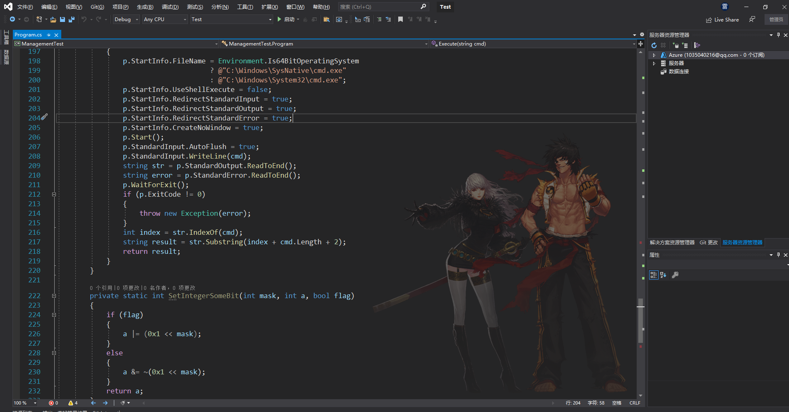
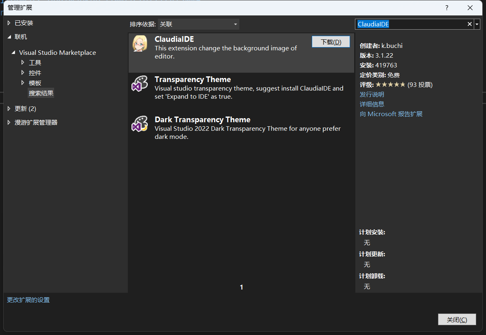
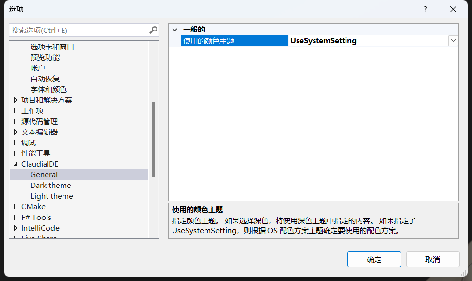
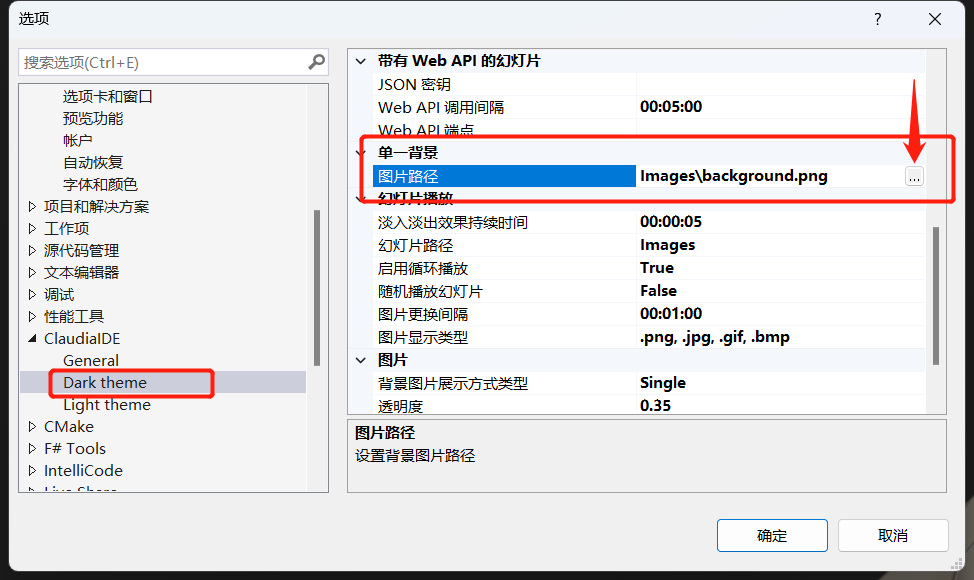

# ClaudiaIDE-ImageCollection

#### 介绍
为撸码加动力(图片如有侵权,请联系删除)

#### 使用效果
> visual studio

#### 安装教程
> visual studio

【扩展】->【管理扩展】->【联机】->【搜索】->【ClaudiaIDE】->【安装】

【工具】->【选项】->【ClaudiaIDE】-> 选择对应的设置

【替换喜欢的图片】（路径不要有中文）

#### 参与贡献(或者提供图片)

1.  Fork 本仓库
2.  新建 Feat_xxx 分支
3.  提交代码
4.  新建 Pull Request